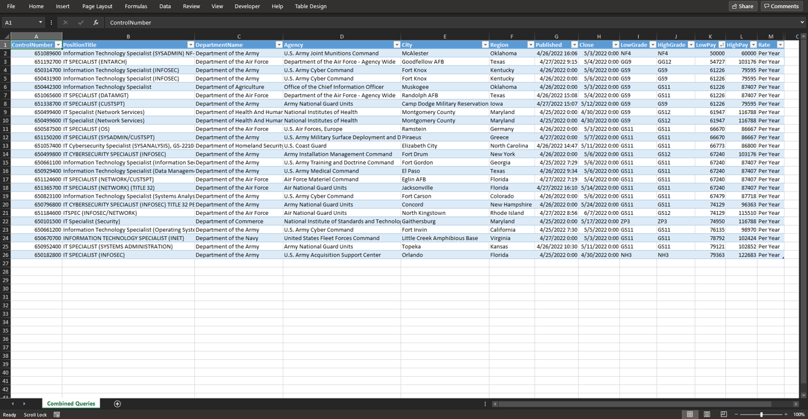

# get-usajobs

Tools to automate USAJOBS searches. Targeted toward IT/technology. Ironically, it does not contain a `get-usajobs` cmdlet.

It's tough to find a job with the Federal government. USAJOBS is helpful, but has some UX issues that could be improved. You may find yourself spending an inordinate amount of time tweaking keywords, pay grades, locations, and other parameters to find remotely good matches. Even still, you must contend with generic postings and irrelevant results with excessive vertical sprawl (much like this README).

`get-usajobs` helps alleviate some of this by providing an easy way to tune search parameters and automate custom searches.

You can search based on saved queries, command line input, or a combination of both. Optionally, you can export output to an Excel spreadsheet.

## Example Terminal Output


## Example Excel output



## Prequisites

* Powershell 7
* [`ImportExcel`](https://github.com/dfinke/ImportExcel/blob/master/README.md#how-to-videos)
* [USAJOBS API Key](https://developer.usajobs.gov/APIRequest/Index)
  
## Getting Started

### Installation

Import the module as you would any other module.

### Configuration

`get-usajobs` will create `config/queries.json` if it doesn't exist. You can use the example saved query as a template for other queries. You should be able to use any parameter that the [USAJOBS Search API](https://developer.usajobs.gov/API-Reference/GET-api-Search) supports. Keep in mind, some parameters may not work as expected, and the only ones that have been tested are the ones supported by the command line:

* Job Category Code
* Keyword Search
* Pay Grade Low/High
* Posted # of days ago
* Server Sort Field

### API Key

The cmdlets that require an API key will look to `$Global:ApiKey` if one isn't provided, so you can assign the key to `$ApiKey` in your session and not provide it each time.

### Find a job

```PowerShell
#Find a job using a saved query. Note that you can tab-complete the saved queries
$jobs = Find-Usajobs -SavedQuery 'IT Jobs'

#Find a job using command line options 
$jobs = Find-Usajobs -JobCategoryCode 2210 -PayGradeLow 07 -PayGradeHigh 11 -PositionTitle "(INFOSEC)"

$jobs = Find-Usajobs -JobCategoryCode 2210 -PayGradeLow 07 -PayGradeHigh 11 -Keyword "Systems Administration"
```

Note the different usage of `-PositionTitle` vs. `-Keyword` in the preceding example. Experiment with various combinations to tune your results.

You can also filter search results out that you have already applied for or are not interested in if you provide `Find-Usajobs` with their corresponding Control Numbers. Just provide it with an array of Control Number strings.

```PowerShell
#Spreadsheet contains column 'ControlNumber'
$cnfilter = Import-Excel 'C:\JobTracker.xlsx' | Select -expand 'ControlNumber'

#Filter out these jobs
$jobs = Find-Usajobs -JobCategoryCode 2210 -PayGradeLow 09 -PayGradeHigh 13 -ControlNumberFilter $cnfilter -Keyword "AWS"
```

### Generate an Excel report

```PowerShell
#Specify the Excel Worksheet name in -Name. Optionally provide a path.
Export-UsajobsReport -ReportObject $jobs -Name 'AWS'
```

The spreadsheet must be closed to export. Furthermore, there should not already be a worksheet with the provided name.

The control numbers in the output are clickable links to the job posting.

### `AllQueriesController.ps1` script

This script will execute all of your saved queries and then generate an Excel spreadsheet containing the results.

```PowerShell
.\scripts\AllQueriesController.ps1 -ControlNumberFilter $cnfilter -PostedDaysAgo 3 -CombineResults
```

`-PostedDaysAgo` can be used to limit results to jobs posted within the number provided. This is useful for only searching for newly posted positions. Keep in mind the filtering is done client side, as the API parameter for this seems to be broken.

`-CombineResults` can be used to union the results into one worksheet instead of generating a separate one for each query.
