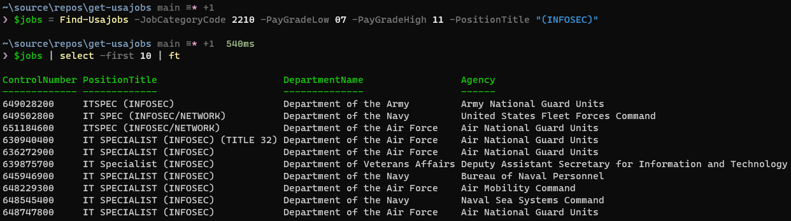

# get-usajobs
Tools to automate USAJOBS searches. Targeted toward IT/technology. Ironically, it does not contain a `get-usajobs` cmdlet.

You can search based on saved queries, command line input, or a combination of both. Optionally, you can export output to an Excel spreadsheet.

## Example Terminal Output

## Example Excel output

## Prequisites

* Powershell 7
* [`ImportExcel`](https://github.com/dfinke/ImportExcel/blob/master/README.md#how-to-videos)
* [USAJOBS API Key](https://developer.usajobs.gov/APIRequest/Index)
  
## Getting Started

### Installation

Import the module as you would any other module.

### Configuration

`get-usajobs` will create `config/queries.json` if it doesn't exist. You can use the example saved query as a template for other queries. You should be able to use any parameter that the [USAJOBS Search API](https://developer.usajobs.gov/API-Reference/GET-api-Search) supports. Keep in mind, some parameters may not work as expected, and the only ones that have been tested are the ones supported by the command line:

- Job Category Code
- Keyword Search
- Pay Grade Low/High
- Posted # of days ago
- Server Sort Field

